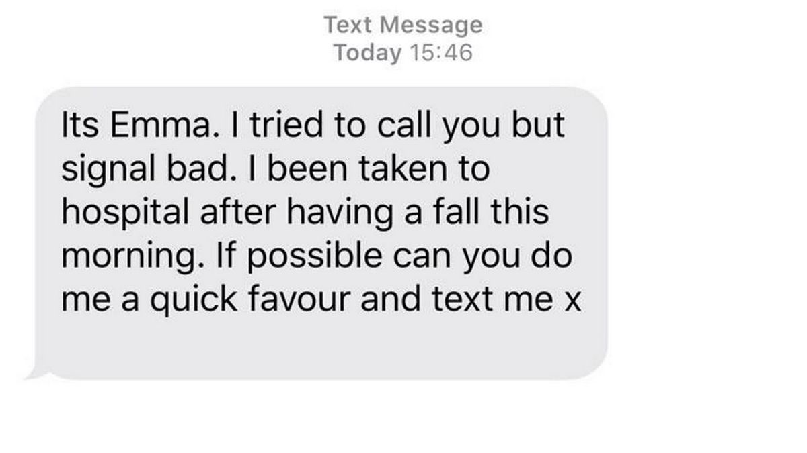
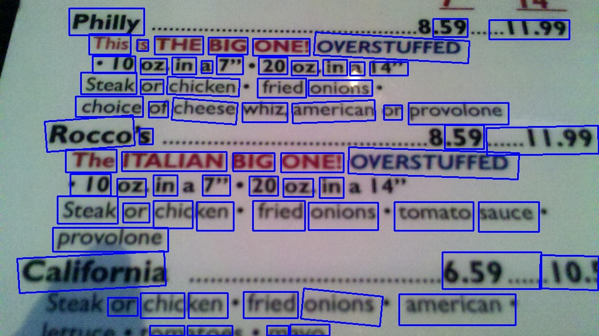
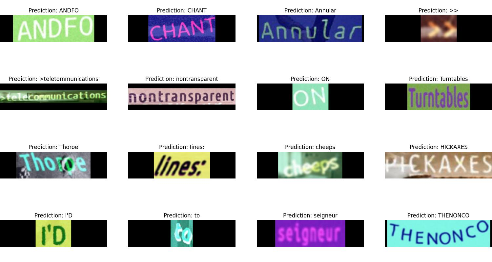

# ocr keras

This project includes 2 networks. The first is for detecting text on images, the second is for recognition.
PixelLink + VGG16 2s was used for detection. I implemented the model (only testing, no training) and carried out the transfer of weights from TF Checkpoints to h5 weights. You can find the original implementation and weights [here](https://github.com/ZJULearning/pixel_link/tree/00cb9aacc80583a8aba77d6834748ab4cca03254).
CRNN + CTC was used for text recognition. The training data was generated using [SynthTIGER](https://github.com/clovaai/synthtiger).
## Prerequisite
I have used these packages. You can probably use older versions as well. Haven't tested this.

- python-3.10.5
- tensorflow-2.11.0
- opencv-4.7.0.72
- numpy-1.24.2
- matplotlib-3.7.0

## Usage
```
usage: main.py [-h] [-p] [-d] [-i IMAGE] [-o] [-t] [-pi PATH_IMAGES] [-pl PATH_LABELS] [-m MODEL]

options:
  -h, --help            show this help message and exit
  -p, --predict         Search and text recognition
  -d, --detect          Detection model inference
  -i IMAGE, --image IMAGE
                        Path to image for text detection and recognition (or only detection)
  -o, --ocr             OCR model inference
  -t, --ocr_train       OCR model training
  -pi PATH_IMAGES, --path_images PATH_IMAGES
                        Path to images for OCR model inference or model training. if you want to do inference, you need to specify the path to a directory containing only images
  -pl PATH_LABELS, --path_labels PATH_LABELS
                        Path to labels for OCR model training
  -m MODEL, --model MODEL
                        The save path for the trained model, or the path if you want to load the model
```

## Examples
#### Text detection + recognition

```
python main.py -p -i path/to/image -m path/to/ocr/model
```

This works well with plain text. It's good if the characters have the same size.

<p> </p>


~~~
Text Today Message 16 40 
Its Emma I tried to call you but
signal bad. |bee n taken to
hosoital after having a fall this
morning If possible can you do
me a quick favour ano te Xt me
~~~

#### Text detection 
```
python main.py -d -i path/to/image
```
<p> </p>

#### OCR (recognition)
```
python main.py -o -pi path/to/img/dir -m path/to/ocr/model
```
<p> </p>

#### Training OCR model
```
python main.py -t -pi path/to/img/dir -pl path/to/labels -m path/to/ocr/model
```

# References
+ [(paper) PixelLink: Detecting Scene Text via Instance Segmentation](https://arxiv.org/abs/1801.01315)
+ [(repo) PixelLink](https://github.com/ZJULearning/pixel_link/tree/00cb9aacc80583a8aba77d6834748ab4cca03254)
+ [(repo) SynthTIGER](https://github.com/clovaai/synthtiger)
